# Flask + MySQL Cloud Student Deployment Test

This project is a Flask web application integrated with a MySQL database and deployed on an AWS EC2 instance. It includes user registration, login, password reset, protected dashboard, and an administrator portal.

---

## 📋 Features

- User Registration with password hashing
- User Login and Session Management
- Protected User Dashboard
- Password Reset using username or email
- Separate Admin Login
- Admin Dashboard
- Total User and Admin Count
- Registered Users Table
- MySQL Database Integration
- Environment Variable Configuration
- AWS EC2 Deployment

---

## 🛠️ Technologies Used

- Python
- Flask
- PyMySQL
- MySQL
- Werkzeug
- python-dotenv
- HTML
- CSS
- AWS EC2

---

# Task 1: MySQL Database Initialization

## 1. Install and Start MariaDB Server on Amazon Linux

Install MariaDB 10.5 Server:

```bash
sudo yum install mariadb105-server -y
```

Start the MariaDB service:

```bash
sudo systemctl start mariadb
```

Enable MariaDB to start automatically on boot:

```bash
sudo systemctl enable mariadb
```

Check the service status:

```bash
sudo systemctl status mariadb
```

Login to MariaDB:

```bash
sudo mriadb 
```
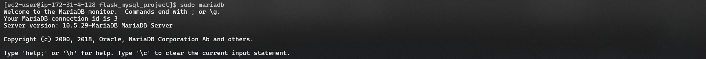

## 2. Create Database and Users Table

The following SQL queries are used to initialize the database. Alternatively, the `schema.sql` file can be imported directly.

```sql
-- Create Database
CREATE DATABASE IF NOT EXISTS `cloud_test_db`
DEFAULT CHARACTER SET utf8mb4
COLLATE utf8mb4_unicode_ci;

USE `cloud_test_db`;

-- Create Users Table
CREATE TABLE IF NOT EXISTS `users` (
    `id` INT AUTO_INCREMENT PRIMARY KEY,
    `username` VARCHAR(50) NOT NULL UNIQUE,
    `email` VARCHAR(100) NOT NULL UNIQUE,
    `password_hash` VARCHAR(255) NOT NULL,
    `role` ENUM('user', 'admin') DEFAULT 'user',
    `created_at` TIMESTAMP DEFAULT CURRENT_TIMESTAMP
) ENGINE=InnoDB DEFAULT CHARSET=utf8mb4;
```

---
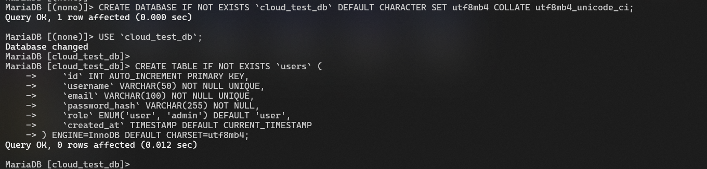
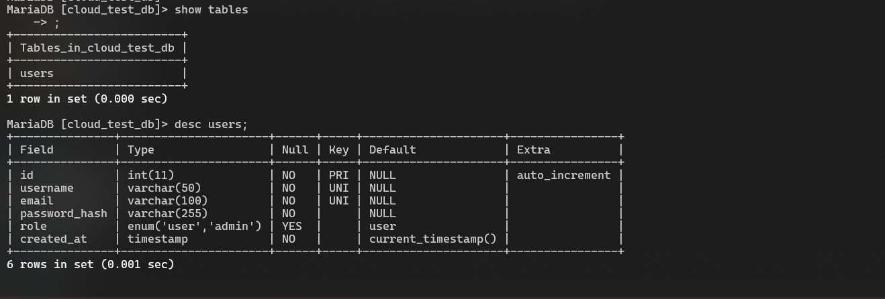
## 3. Create Default Administrator

Default administrator details:

- **Username:** `admin`
- **Email:** `admin@cloudtest.com`
- **Password:** `admin123`
- **Role:** `admin`

The administrator password is stored as a secure password hash instead of plain text.

Generate the password hash using Werkzeug:

```bash
python3 -c "from werkzeug.security import generate_password_hash; print(generate_password_hash('admin123'))"
```

Insert the generated hash into the database:

```sql
INSERT INTO `users` (`username`, `email`, `password_hash`, `role`)
VALUES (
    'admin',
    'admin@cloudtest.com',
    'PASTE_GENERATED_PASSWORD_HASH_HERE',
    'admin'
)
ON DUPLICATE KEY UPDATE `username`=`username`;
```

> Replace `PASTE_GENERATED_PASSWORD_HASH_HERE` with the hash generated for `admin123`.

---
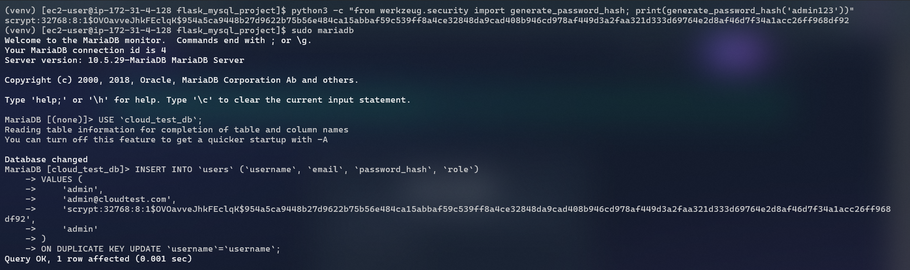

Verify the database:

```sql
SELECT * FROM users;
```
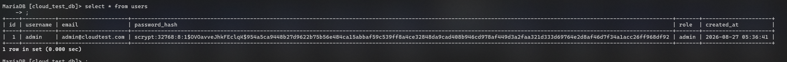

### Database Screenshots


---

## Import `schema.sql` Directly

Instead of manually executing the SQL queries, the database schema can be imported using:

```bash
mysql -u root -p < schema.sql
```
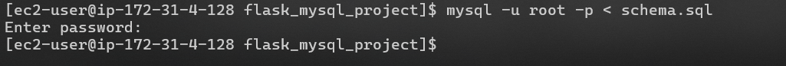
---

# Task 2: Flask App & Environment Configuration

## 1. Clone the Repository

```bash
git clone <repository_url>
cd flask_mysql_project
```

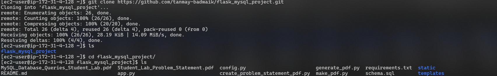

---

## 2. Create Python Virtual Environment

Create a virtual environment:

```bash
python3 -m venv venv
```

Activate it:

```bash
source venv/bin/activate
```
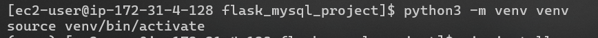

For Windows:

```powershell
python -m venv venv
venv\Scripts\activate
```

---

## 3. Install Dependencies

```bash
pip install -r requirements.txt
```

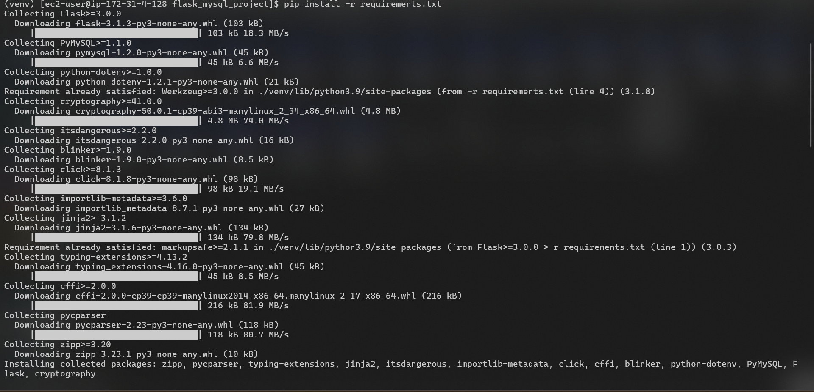

---

## 4. Configure Environment Variables

Copy `.env.example` to `.env`:

```bash
cp .env.example .env
```
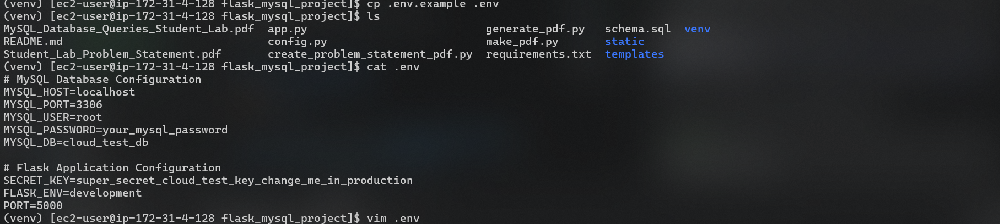

For Windows PowerShell:

```powershell
Copy-Item .env.example .env
```

Configure `.env`:

```env
MYSQL_HOST=localhost
MYSQL_PORT=3306
MYSQL_USER=root
MYSQL_PASSWORD=your_mysql_password
MYSQL_DB=cloud_test_db
SECRET_KEY=your_generated_secret_key
PORT=5000
```

---

## 5. Generate Flask Secret Key

Generate a random secret key:

```bash
python3 -c "import secrets; print(secrets.token_hex(32))"
```
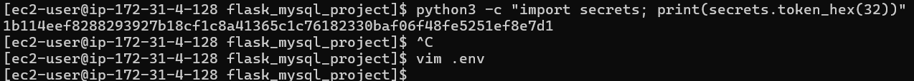

Copy the generated value and add it to `.env`:

```env
SECRET_KEY=your_generated_secret_key
```

The Flask secret key is stored in `.env` instead of being hardcoded in the application.

The `config.py` file loads the configuration:

```python
import os
from dotenv import load_dotenv

load_dotenv()

class Config:
    SECRET_KEY = os.getenv('SECRET_KEY')

    MYSQL_HOST = os.getenv('MYSQL_HOST', 'localhost')
    MYSQL_PORT = int(os.getenv('MYSQL_PORT', 3306))
    MYSQL_USER = os.getenv('MYSQL_USER', 'root')
    MYSQL_PASSWORD = os.getenv('MYSQL_PASSWORD', '')
    MYSQL_DB = os.getenv('MYSQL_DB', 'cloud_test_db')
```

---

## 🔒 Protect Environment Variables

The `.env` file contains database credentials and the Flask secret key, so it should not be pushed to GitHub.

Add the following to `.gitignore`:

```gitignore
.env
venv/
__pycache__/
*.pyc
```

---

# Task 3: User Authentication & Protected Dashboard

## 👤 User Registration

New users can register using:

- Username
- Email
- Password

User passwords are securely hashed using Werkzeug before being stored in the MySQL database.

## 🔑 User Login

Registered users can log in using their credentials.

After successful authentication, Flask sessions are used to maintain the logged-in user session.
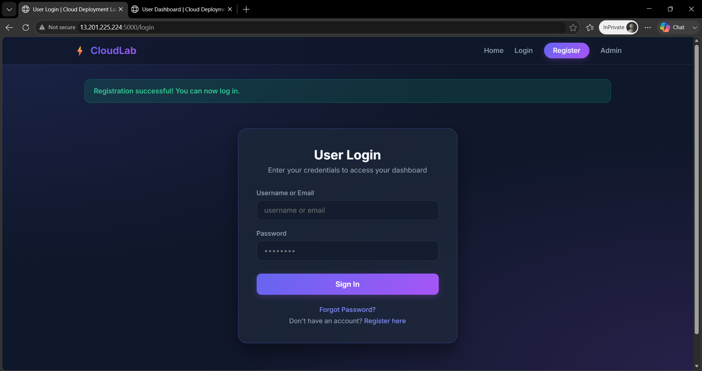


## 🖥️ Protected User Dashboard

The User Dashboard is accessible only after successful login.

The dashboard displays:

- Username
- Email
- Role
- Registration Date

Unauthenticated users cannot directly access the protected dashboard.

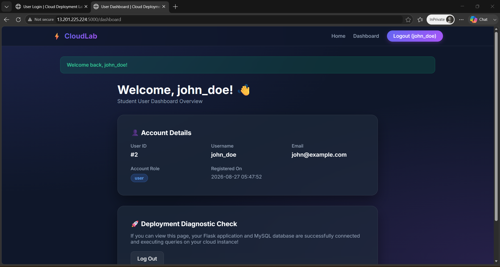


## 🔄 Password Reset

Users can reset their password using their registered username or email address.

The new password is hashed before being updated in the MySQL database.


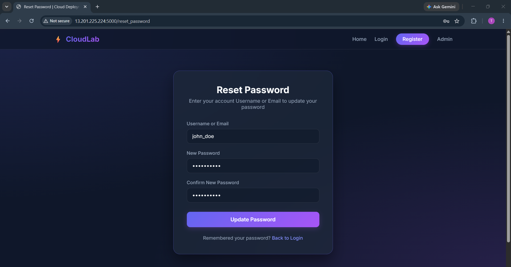
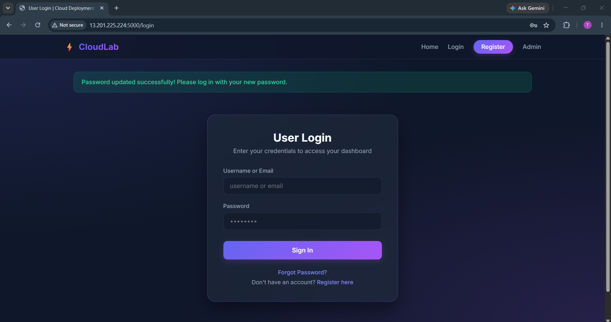
---

# Task 4: Administrator Management Portal

## 👨‍💼 Admin Login

A separate administrator login interface is provided at:

```text
/admin/login
```

For AWS EC2:

```text
http://<EC2-PUBLIC-IP>:5000/admin/login
```
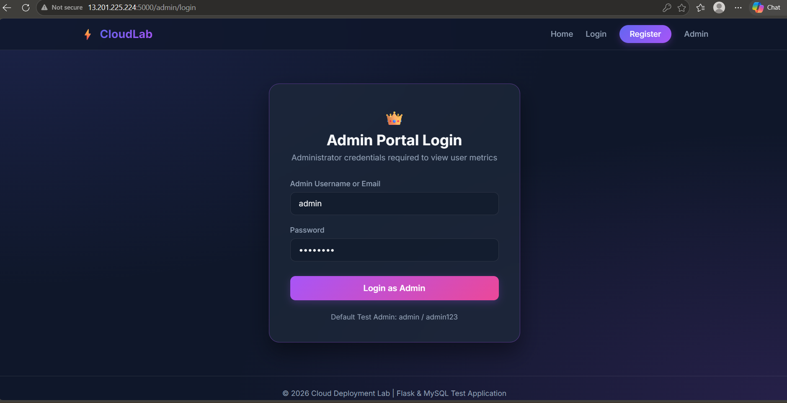

Only users with:

```text
role = admin
```

can access the Admin Dashboard.
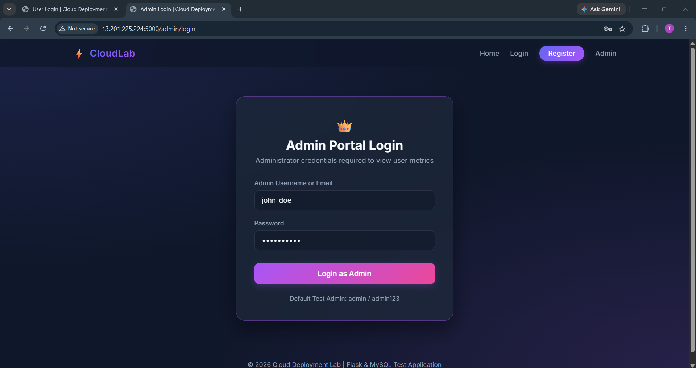
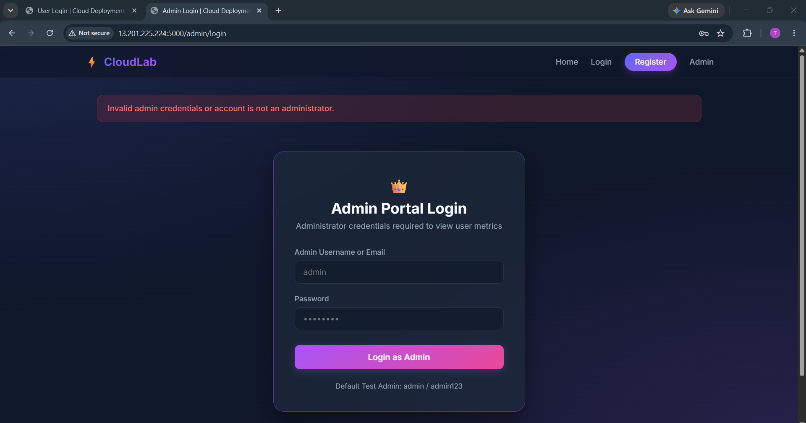


## 📊 Admin Dashboard

The Admin Dashboard displays:

- Total Registered Student Users
- Total Administrator Accounts
- Registered Users Table

The registered users table displays:

- Username
- Email
- Role
- Registration Date
  
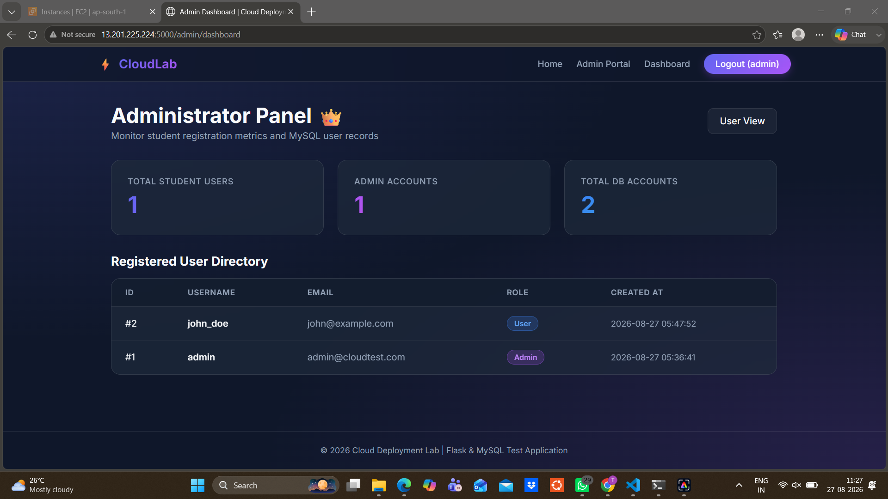

## 🔐 Default Admin Credentials

| Field | Value |
|---|---|
| Username | `admin` |
| Email | `admin@cloudtest.com` |
| Password | `admin123` |
| Role | `admin` |
| Admin Portal | `/admin/login` |

---

# Task 5: Cloud Deployment & Security Configuration

## ☁️ AWS EC2 Deployment

The Flask application is deployed on an AWS EC2 instance.

The application runs on:

```text
Host: 0.0.0.0
Port: 5000
```

The Flask application is configured with:

```python
if __name__ == '__main__':
    app.run(host='0.0.0.0', port=5000)
```

---

## 🚀 Run the Application

Activate the virtual environment:

```bash
source venv/bin/activate
```

Start the application:

```bash
python3 app.py
```

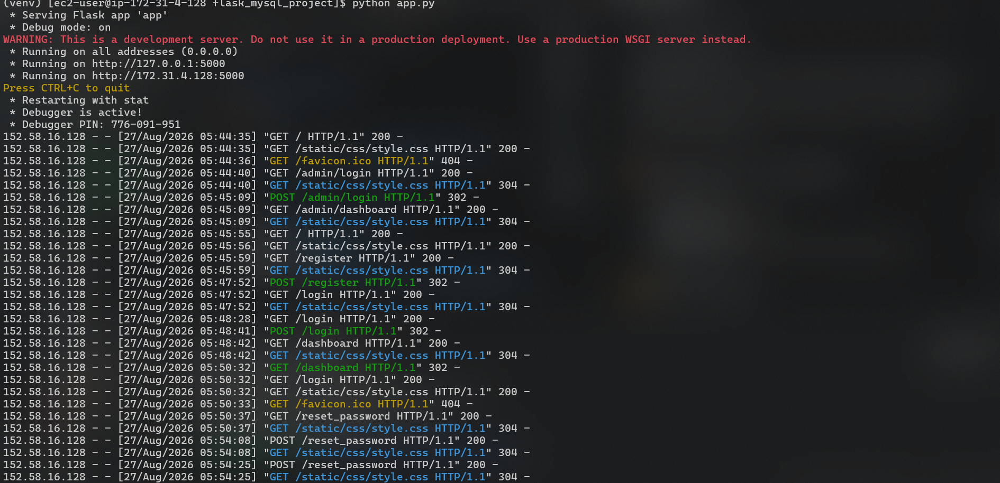

Access the application using:

```text
http://<EC2-PUBLIC-IP>:5000
```

---

## Run Application in Background

To keep the application running after the SSH connection closes:

```bash
nohup python3 app.py > app.log 2>&1 &
```

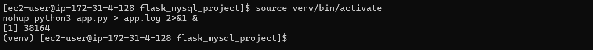
Check the process:

```bash
ps aux | grep app.py
```

Check application logs:

```bash
cat app.log
```

---

## 🔥 AWS Security Group Configuration

Configure the EC2 Security Group to allow inbound TCP traffic on port `5000`.

| Type | Protocol | Port Range | Source |
|---|---|---|---|
| Custom TCP | TCP | 5000 | 0.0.0.0/0 |

The application can then be accessed at:

```text
http://<EC2-PUBLIC-IP>:5000
```

---

# 📂 Project Structure

```text
flask_mysql_project/
├── app.py
├── config.py
├── schema.sql
├── requirements.txt
├── .env
├── .env.example
├── .gitignore
├── README.md
├── screenshots/
│   ├── mysql21.png
│   ├── mysql22.png
│   ├── mysql23.png
│   ├── git.png
│   ├── venv.png
│   ├── cp.png
│   └── start.png
├── templates/
│   ├── base.html
│   ├── index.html
│   ├── register.html
│   ├── login.html
│   ├── reset_password.html
│   ├── dashboard.html
│   ├── admin_login.html
│   └── admin_dashboard.html
└── static/
    └── css/
        └── style.css
```

---

# 🔒 Security Features

- User passwords are stored as password hashes.
- Default administrator password is stored as a hash.
- Flask `SECRET_KEY` is stored in `.env`.
- MySQL credentials are stored in `.env`.
- Secret values are not hardcoded in the application.
- `.env` is excluded from Git.
- User Dashboard requires authentication.
- Admin Dashboard requires the `admin` role.
- Flask sessions are used for authentication.

---

# ✅ Practical Exam Tasks Completed

- [x] MySQL Server installed and started
- [x] `cloud_test_db` database created
- [x] `users` table created
- [x] Username and Email configured as UNIQUE
- [x] Default administrator created
- [x] `admin123` stored as a password hash
- [x] Python virtual environment created
- [x] Dependencies installed from `requirements.txt`
- [x] MySQL connection configured through `.env`
- [x] Flask `SECRET_KEY` configured through `.env`
- [x] User Registration implemented
- [x] User Login implemented
- [x] Session authentication implemented
- [x] Protected User Dashboard implemented
- [x] Password Reset implemented
- [x] Separate Admin Login implemented
- [x] Admin role verification implemented
- [x] Total Student User count displayed
- [x] Total Administrator count displayed
- [x] Registered Users Table displayed
- [x] Application running on `0.0.0.0:5000`
- [x] AWS Security Group configured for port `5000`
- [x] Application accessible through EC2 Public IP

---

# 🧪 Practical Demonstration

## 1. Live Application

```text
http://13.201.225.224:5000/
```

## 2. User Demonstration

1. Register a new student user.
2. Login using the registered account.
3. Access the protected User Dashboard.
4. Reset the account password.
5. Login using the updated password.

## 3. Admin Demonstration

Open:

```text
http://13.201.225.224:5000/admin/login
```

Login using:

```text
Username: admin
Password: admin123
```

The Admin Dashboard displays:

- Total Registered Student Users
- Total Administrator Accounts
- Registered Users Table

## 4. MySQL CLI Demonstration

Login to MySQL:

```bash
mysql -u root -p
```

Select the database:

```sql
USE cloud_test_db;
```

Display all users:

```sql
SELECT * FROM users;
```

The database should contain the default administrator account and at least two registered student users.


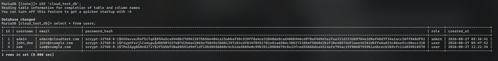
---

# 📊 Practical Exam Requirements

| Task | Description | Marks | Status |
|---|---|---:|---|
| Task 1 | MySQL Database Initialization | 20 | ✅ Completed |
| Task 2 | Flask App & Environment Configuration | 20 | ✅ Completed |
| Task 3 | User Authentication & Protected Dashboard | 20 | ✅ Completed |
| Task 4 | Administrator Management Portal | 20 | ✅ Completed |
| Task 5 | Cloud Deployment & Security Configuration | 20 | ✅ Completed |
| **Total** | **Practical Demonstration & Code Review** | **100** | **Completed** |

---

# 📝 Submission Deliverables

## 1. Live Demonstration URL

```text
http://13.201.225.224:5000
```

## 2. Admin Credentials

```text
Username: admin
Password: admin123
```

## 3. MySQL CLI Output

```sql
SELECT * FROM users;
```

The database contains the default administrator account and at least two registered student users.


---

# 🎯 Conclusion

The Flask + MySQL web application was successfully configured and deployed on AWS EC2. The application provides user authentication, password reset, protected dashboards, administrator role-based access, MySQL database integration, environment-based secret configuration, and access through the EC2 Public IP on port `5000`.